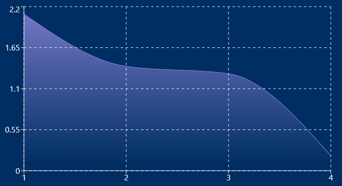

# Chart

In this component will handle the different options for the chart that will be shown on top of the form (this one):

For dev purposes we use dummy data, but it will be changed following different changes on the project itself.
