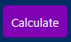
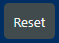

# Button

This component is prepared to represent the different buttons that will be used through the app, in a simple way to set-up, as it shows this example in Form.js:

`
<Button type="submit" buttonType="primary">Calculate</Button>
`

For now we only have 2 types of Buttons:

- primary
- secondary

Examples of the different buttons here:

And if you want to choose which one to use depending on the type of button, the allowed parameters for *buttonType* prop are:

- "primary"
- "secondary"

Of course the name tells you which option represents which button.
